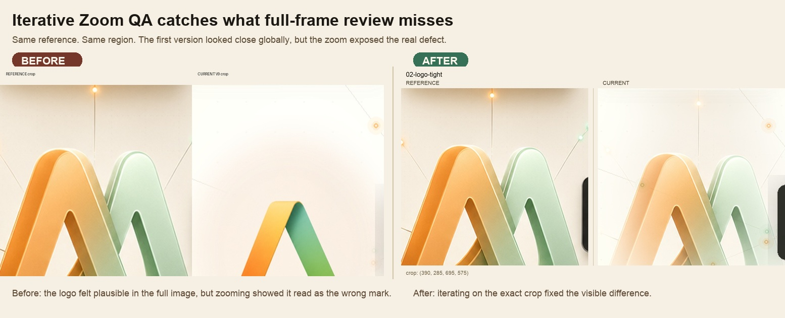

# Iterative Zoom QA

AI agents are pretty good at comparing a result to a reference image — until the important difference is small.

They may say a design “looks close” while missing the thing you actually care about: a wrong logo, a visible compositing seam, a square shadow, a rotated label, or a miscentered icon.

**Iterative Zoom QA fixes that by making the agent compare the image like a designer would: start broad, crop the suspicious region, zoom in, name the exact difference, change only that thing, and check the same crop again.**



## Install

```bash
npx skills add dannyshmueli/skills --skill image-zoom-qa
```

## What's included

```text
SKILL.md                         # Agent instructions
scripts/image_zoom_qa.py         # Deterministic crop-board generator
references/example-regions.json  # Example custom crop map
assets/images/                   # Public examples
```

## Quick use

```bash
python3 -m pip install Pillow
python3 scripts/image_zoom_qa.py \
  --reference path/to/reference.png \
  --current path/to/current.png \
  --out image-zoom-qa \
  --canvas-size 1080
```

## License

MIT
